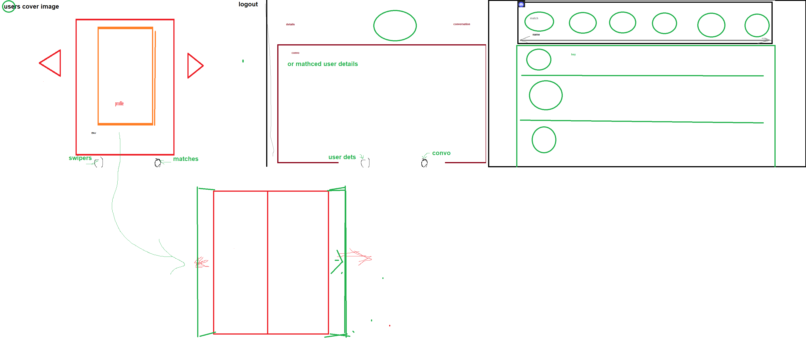

# KEROSENE DATING-APP - "Can you handle the heat?"
### A project by [Chris](https://github.com/ChristopherHendrickson), [Travis](https://github.com/Travis-Esselink) and [Adora](https://github.com/AdoraWyne)

Check out the heatest dating app [here] (...)

**Username**: Dido
**Password**: 1234

## About the Project
Our project is to build a dating app with the swiping function.

## Technologies Used:
* CSS
* Bootstrap
* Javascript
* Node.js
* Express.js
* React
* MongoDB Cloud
* Firebase
* Github
* Heruko

## Features:
* Users can register a new account, edit the profile information and delete their profile once found the true love. 
* Not only the users can upload one profile picture, they can upload multiple pictures in their gallery and all the images will be shown in carousel.
* Swiping function based on users' preferences.
* Once swiped left (not interested), the un-interested profiles will never be shown again.
* With the chatting function, once swiped right and it's a matched, users can start chatting with the matched profiles.
* Users can unmatch anytime they want and all the chat history will be deleted. 
* The app is styled with responsive design. 

## General Approach
We had a few ideas of what to do with our first group project and we chose dating app eventually thinking this would be fun!

We started by discussing what functions we want it to be in our app. Then discuss how to structure our model, then the routes and components. 

Once we have roughly idea, we proceeded to sketch the user interface by using Paint.
Wireframe:

We distributed the tasks based on personal's strength and had a few discussion everyday to make sure everyone is on the same page.

## Challenges and Unsolved Problems
### Private Routes
* We set all the routes as PrivateRoute except the Landing Page. However, after logged in and refreshed the page, it will kick the user back to Landing Page while the user is still logged in. We made a new state as userFetched, if there's a user Loading component, then only the routes wrapped by Private Routes.

### The Matching Function

### Chat

## Future Improvements

## Credits & Acknowledgement

Images are from:
* [Unsplash](https://unsplash.com/)
* [Icons8](https://icons8.com/)
* [Flaticon](https://www.flaticon.com/)

Explanations of the technologies used
A couple paragraphs about the general approach you took
Installation instructions for any dependencies
Link to your wireframes – sketches of major views / interfaces in your application
Descriptions of any unsolved problems or major hurdles your team had to overcome
A link to your hosted working app in the README and URL section of your GitHub repo
