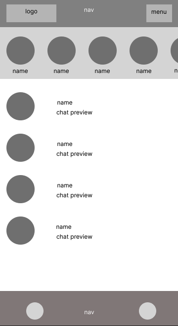
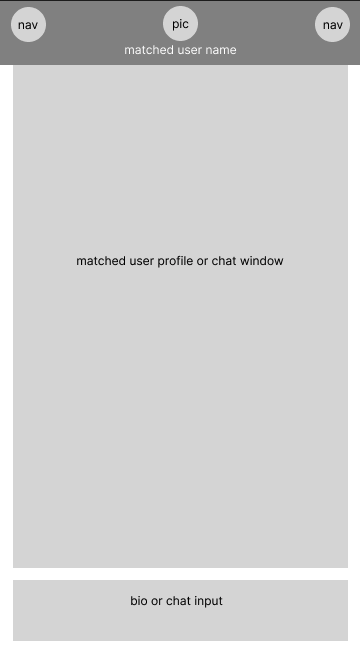
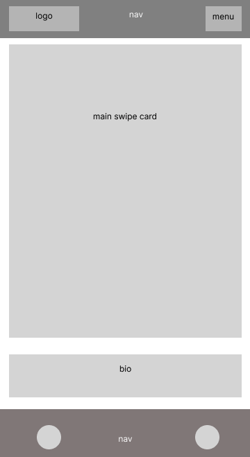

# KEROSENE DATING-APP - "Can you handle the heat?"
### A project by [Chris](https://github.com/ChristopherHendrickson), [Travis](https://github.com/Travis-Esselink) and [Adora](https://github.com/AdoraWyne)

Check out the hottest dating app [here](https://kerosene.onrender.com/)!

**Username**: Dido

**Password**: 1234

## About the Project
A modern dating app complete with swiping functionality and live chat.

## Technologies Used:
* CSS
* Bootstrap
* Javascript
* Node.js
* Express.js
* React
* MongoDB Cloud
* Firebase
* Github
* Heroku

## Features
* Users can register a new account, edit profile information and delete their profile once they've found true love. 
* Users can upload multiple pictures in their gallery and all the images will be shown via carousel.
* Swiping function based on users' preferences.
* Once a profile is swiped left on (not interested), that profile will never be shown to the user again.
* Once swiped right and it's a match, users can start chatting with their matched profiles. In the Chat UI, users can see a preview of their latest messages.
* Users can unmatch anytime they want and all the chat history will be deleted. 
* The app is styled with responsive design but designed with mobile use as a priority.

## General Approach
We had a few ideas of what to do with our first group project and settled on a dating app eventually, thinking this would be both challenging and fun!

We started by discussing which functions we wanted to exist within our app. Then discussed how to structure our model, then the routes and components. 

Once we had a rough outline, we proceeded to make mock-up wireframes.

Wireframe:

Matched Users List         |  Matched User Profile     | Main Page (Swiping Card) |
:-------------------------:|:-------------------------:|:-------------------------:
 | |  |

We distributed the tasks based on each team member's personal strengths and held meetings everyday to make sure everyone was on the same page.

## Challenges
### The Swiping Function
We were intending to use CSS Animation for the swiping functionality, however, we found a react-tinder-card package that was ideal for our project. Kudos to the creator!
This package required the installation of two dependencies, the most compatible version being react-tinder-card 1.5.4. 

Without this version we came across an error that had been noted by the creator on his gibhub regarding this particular package.
```
npm install --save react-tinder-card@1.5.4
```
Due to our app being built in react, the below was also necessary:
```
npm install --save @react-spring/web@9.5.5
```
You can also read more about this package at [here](https://www.npmjs.com/package/react-tinder-card).

### Private Routes
We setup all the routes as PrivateRoute or PrivateAndSetUpRoute except for the Landing Page. However, after logging in and refreshing the page, the user would be kicked back to Landing Page while the user is still logged in. 

To solve this, we set a new state - userFetched. The initial value of userFetched is false while waiting for the backend to check and send the frontend information regarding whether there is a user logged in. When userFetched is false, the loading page will be rendered. This has been specified in all the necessary children components as conditional rendering. 

Once the frontend has the details of the logged-in user or wheter there is no current user, userFetched will be set as true. Then, it will render based on what we set in the PrivateRoute or PrivateAndSetUpRoute if there is a logged-in user or not.

### Chat Function with Firebase
Firebase Realtime Database implementation into react proved to be a challenge at first,  as there were several syntax discrepancies across previous and current firebase versions. 

These syntax issues were consolidated by consulting the offical google [firebase documentation](https://firebase.google.com/docs/web/modular-upgrade) for the most recent firebase release.

## Credits & Acknowledgement
To our instructor- Dido and TA- Rob guided us throughout the project.

Images are from:
* [Unsplash](https://unsplash.com/)
* [Icons8](https://icons8.com/)
* [Flaticon](https://www.flaticon.com/)

